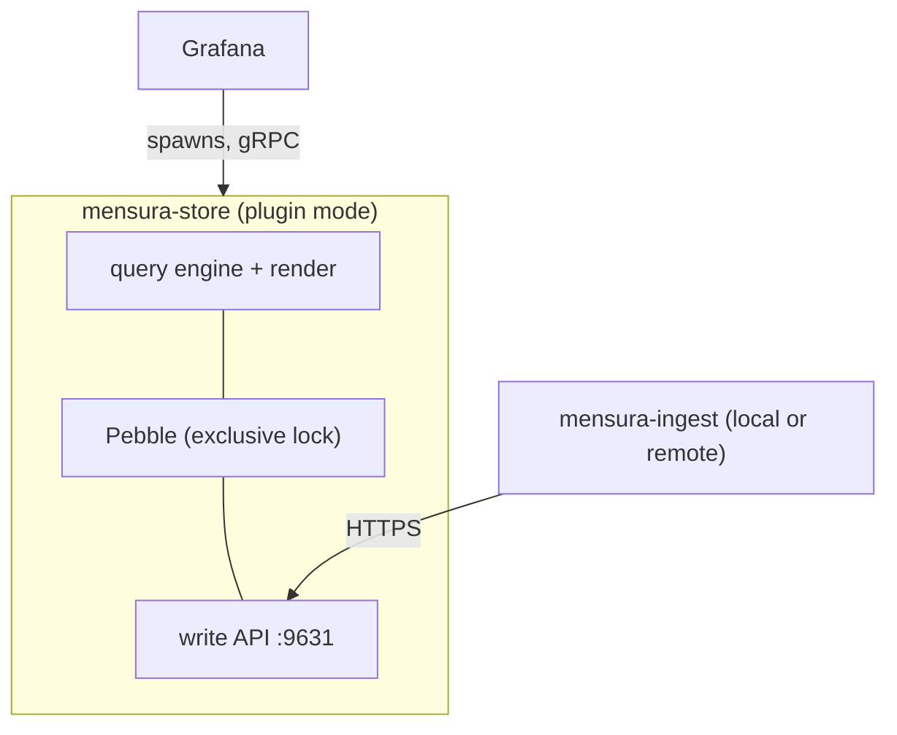
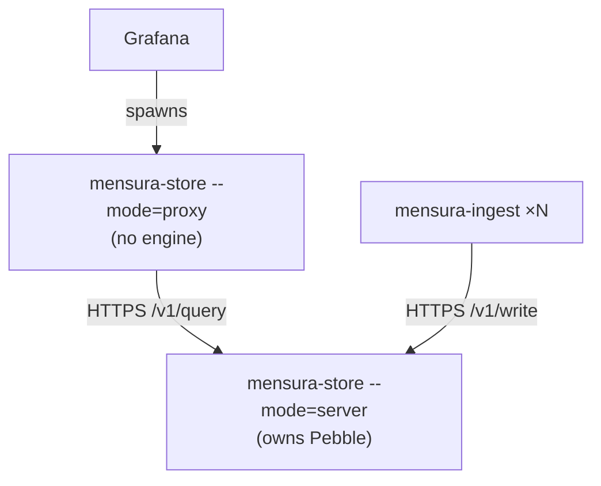

# 01 — Architecture

## 1. Shape of the system

Mensura is three components in two binaries.

```
   ┌──────────────────────────────────────────────────────────────────────┐
   │ mensura-ingest                                                       │
   │                                                                      │
   │  acquire ──► decode ──► extract ──► enrich ──► batch ──► write client │
   │    │           │           │          │                       │      │
   │    │           │           │          └─ stream labels        │      │
   │    │           │           └─ patterns / multiline / histogram│      │
   │    │           └─ text lines, JSON, line-protocol frames      │      │
   │    └─ files · archives · tail · ssh tail · tcp · udp · http   │      │
   └───────────────────────────────────────────────────────────────┼──────┘
                                                                   │
                                            HTTPS  POST /v1/write  │
                                            (protobuf or NDJSON,   │
                                             zstd, idempotency key)│
                                                                   ▼
   ┌──────────────────────────────────────────────────────────────────────┐
   │ mensura-store                                                        │
   │                                                                      │
   │  write API ──► intern ──► batcher ──► engine (Pebble LSM)            │
   │                                          │                           │
   │  query API ◄── planner ◄── render walk ◄─┘                           │
   │      ▲                                                               │
   │      │  in-process call                                              │
   │  ┌───┴─────────────────────────┐                                     │
   │  │ Grafana datasource backend  │  ◄── gRPC ── Grafana                │
   │  └─────────────────────────────┘                                     │
   └──────────────────────────────────────────────────────────────────────┘
```

The three components and their hard boundaries:

**Ingest** knows about *sources and text*. It never opens the database, never
sees the LSM keyspace, and holds no query-side state. Its output is a stream
of `Sample` batches on the wire.

**Store** knows about *rows and time*. It never parses a log line and has no
idea what a rotation is. Its inputs are wire batches; its outputs are data
frames.

**Plugin** knows about *Grafana*. It translates panel requests into MQL
queries and query results into data frames. It has no storage code of its own.

Everything else is shared library code (see §5), used by both binaries.

## 2. Process and ownership model

The engine is an embedded LSM in a single process holding an exclusive
directory lock. Exactly one process may own the data directory at a time.
That single fact determines every topology below.

### 2.1 Embedded topology (default)

Grafana launches the datasource backend as a plugin child process
(`hashicorp/go-plugin` over gRPC, as all backend datasources do). In this
topology **that child process is `mensura-store`**: it opens the data
directory, serves the Grafana query path in-process, and also binds the write
API listener for ingest.



Properties: no hop between plugin and storage; a panel query is a range seek;
the store's lifecycle is Grafana's lifecycle. This is the shape the
whitepaper's latency argument assumes.

Cost: Grafana owns the process lifetime, so a Grafana restart bounces the
store, and the store cannot outlive Grafana to keep accepting writes. That is
acceptable for the incident-triage workflow and unacceptable for a
long-running collection deployment, hence the second topology.

### 2.2 Standalone topology

`mensura-store` runs as its own service and owns the directory. The Grafana
plugin backend runs in a second, *thin* mode (`mensura-store --mode=proxy`,
same binary, no engine): it forwards MQL over the store's query API and
converts responses to frames.



Properties: store survives Grafana restarts; several Grafanas (or none) can
attach; the store can live on a different host from Grafana. Cost: one network
hop and one serialisation round-trip per panel query — measured against a
range scan over millions of rows, this is small but not free.

**Both modes are the same binary and the same code paths.** The only
difference is whether the query engine is called through a function pointer or
through an HTTP client. This is enforced by making the plugin backend depend
on a `QueryService` interface with exactly two implementations, `local` and
`remote`.

### 2.3 What is *not* supported

Two processes opening the same directory. The store detects the Pebble lock
and exits with a specific error naming the other holder's PID file, rather
than blocking or corrupting. This is the single most likely operator mistake
(running the standalone server *and* letting Grafana spawn an embedded
plugin), so it gets an explicit, actionable failure.

## 3. End-to-end flows

### 3.1 One-shot batch import

The P1-triage flow: a pile of logs exists, and dashboards must render in
minutes.

1. Operator runs `mensura-ingest batch --spec server.yaml --source ./bundle.tgz --store https://localhost:9631`.
2. Ingest resolves the source (local path, S3 prefix, SFTP dir), downloads if
   remote, and recursively unpacks archives into a working directory keyed by
   a hash of each original path, so identically-named files from different
   hosts do not collide.
3. Preprocess classifies every file (log / structured / ignore), determines its
   *stream identity* (§4), and rewrites it to a canonical name.
4. Each log file is parsed by one goroutine from a bounded pool; the extraction
   engine emits `Sample`s.
5. Samples are batched per set and flushed to the store's write API.
6. The store interns labels, assigns primary keys, and commits batches into the
   engine.
7. Progress (files found/done, bytes, samples, errors, detected time range) is
   published continuously by ingest and mirrored into the store so a dashboard
   can render an ingest-progress panel while the import runs.
8. When ingest completes it issues `POST /v1/admin/compact` (optional, on by
   default for batch mode), which collapses L0 and pays for itself on the first
   query.

### 3.2 Follow (local)

1. `mensura-ingest follow --spec nginx.yaml --path '/var/log/nginx/*.log' --store …`
2. Each matched path becomes a *followed file* with a checkpoint record
   (see [02-ingest.md §5](02-ingest.md)).
3. New bytes are read, split into records, extracted, batched, and written with
   at-least-once delivery; the checkpoint advances only after the store acks the
   batch containing those bytes.
4. Rotation (rename+create, create+delete, truncate, copytruncate, compressed
   archive) is detected and handled without gaps or duplicates, subject to the
   contract in [02-ingest.md §6](02-ingest.md).

### 3.3 Follow (remote)

Three supported ways, in order of preference:

1. **Agent on the remote host** — `mensura-ingest` runs there and writes to the
   store over HTTPS. Best throughput, survives network blips via local
   checkpoints, needs a deployed binary and an outbound path.
2. **SSH-attached follow** — a central `mensura-ingest` opens an SSH session per
   remote file and streams bytes back, doing all extraction locally. Nothing is
   installed on the target. Checkpoints are held centrally and expressed as
   *(file identity, byte offset)*, replayed with `tail -c +N` on reconnect.
3. **Push from the host's existing shipper** — rsyslog/fluent-bit/vector already
   running on the host send to the ingest receiver over TCP/UDP.

### 3.4 Receive

`mensura-ingest receive` binds listeners and converts inbound traffic into the
same `Sample` stream: a line protocol over TCP (framed, backpressured) and UDP
(fire-and-forget, bounded queue, drop-counted), plus an HTTP JSON endpoint
for callers who would rather POST. Extraction still applies, so a syslog
stream can be pattern-matched exactly like a tailed file.

### 3.5 Query

1. Operator builds a query in the Grafana panel editor (builder or code).
2. Frontend sends the MQL **AST** (not text) in the query model.
3. Plugin backend validates the AST, interpolates Grafana variables, and calls
   `QueryService.Query`.
4. The planner turns it into one covering indexed range scan per time-shard,
   with predicate pushdown and column projection.
5. Rows are grouped into series by a stable group hash.
6. Each series is sorted and run through the ten-stage render walk
   ([07-downsampling.md](07-downsampling.md)).
7. One data frame per series is returned to Grafana.

## 4. Identity model

Identity is declared, never hard-coded. Tools in this space commonly bake in a
fixed pair such as `(cluster, node)`; Mensura instead has *stream identity*, an
ordered set of operator-declared labels.

- **Stream** — the smallest unit of ordered data: one log file on one host, one
  TCP connection, one UDP source, one SSH-followed path.
- **Stream labels** — key/value strings attached to every sample from that
  stream. `host` and `source` are always present (synthesised if not
  configured); anything else is declared in the spec or on the command line
  (`--label dc=eu-west-1 --label app=api`).
- **Discovered labels** — extracted from record content by the spec, typically
  by reading the first few hundred lines of a file rather than trusting its
  name.
- **Field** — a named numeric (or string, for tables) column on a sample.
- **Set** — a named collection of samples sharing a shape; the query `FROM`
  target.

Series identity at query time is `(sorted BY-label values, field display
name)` — see [06-query.md §7](06-query.md).

## 5. Shared code

Both binaries link the same packages; the split is enforced by making
`internal/` imports one-directional.

| Package | Used by | Contents |
| --- | --- | --- |
| `pkg/model` | both | `Sample`, `Batch`, label sets, field metadata, set names, canonical hashing |
| `pkg/wire` | both | Protobuf/NDJSON codecs, HTTP client and server halves of the write and query APIs, retry/backoff policy |
| `pkg/extract` | ingest (and store, for validation) | Spec parsing, Aho-Corasick prefilter, regex extraction, multiline joins, histograms, aggregation |
| `pkg/mql` | both | Lexer, parser, AST, AST↔text printer, validator |
| `pkg/render` | store | The ten-stage walk and its unit-test property suite |
| `internal/engine` | store | Pebble wrapper: sets, schema, codec, index, query builder, stats |
| `internal/plugin` | store | Grafana backend adapter, frame construction |

`pkg/mql` living in the shared set matters: the ingest binary uses it for
`mensura-ingest query` (a debugging client), and tests can round-trip AST →
text → AST without a running store.

## 6. Explicitly excluded, and why

| Concern | Disposition |
| --- | --- |
| Cluster/node deployment, templates, instance sizing, auto-scale monitor | Dropped — not this tool's job |
| Product-specific log patterns and diagnostic-bundle formats | Not in core; expressible as example spec files |
| Web proxy, web terminal, file browser, Grafana provisioning reconciliation | Dropped; optional dashboard provisioning helper only (see [09-operations.md](09-operations.md)) |
| Generic JSON-over-HTTP datasource bridges | Replaced by a native backend datasource |
| In-process ingest writing straight to the LSM | Replaced by the network write API — the enabling change for follow/remote/receive |
| Hard-coded two-level identity | Replaced by declared stream labels |
| Hard-coded fixed-bucket histogram endpoint | Replaced by declared bucket sets and a heatmap query format |
| No retention at all | Retention (time-sharded sets); unbounded remains the batch-mode default |
