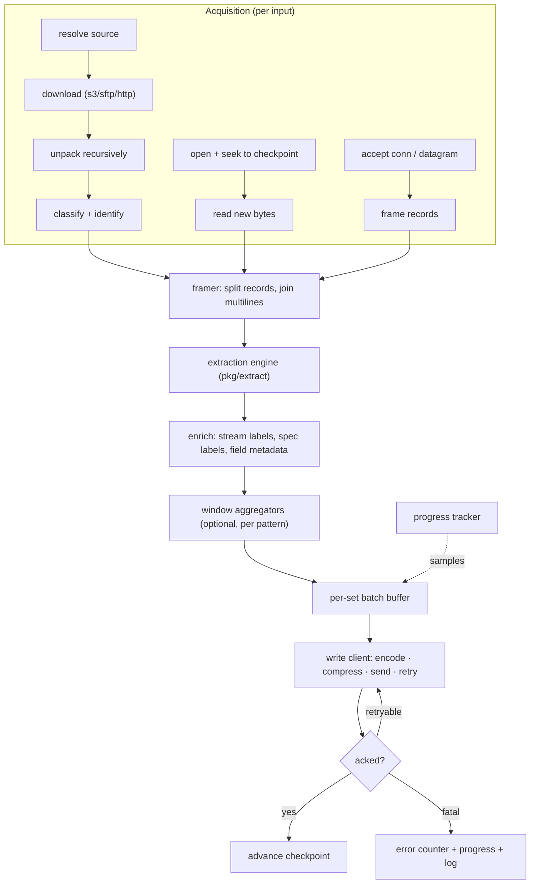

# 02 — Ingest (`mensura-ingest`)

## 1. Responsibilities and non-responsibilities

`mensura-ingest` acquires bytes, turns them into samples, and delivers those
samples to a store over the write API. It owns:

- source resolution, download and unpacking;
- stream identity discovery and labelling;
- record framing (line splitting, multiline joining, structured decoding);
- extraction (timestamp, labels, fields) per the spec;
- local aggregation and histogram derivation;
- checkpointing and resume;
- batching, compression, retry and backpressure toward the store;
- progress reporting.

It does **not** own the database, does not know the LSM keyspace, does not
assign primary keys (the store does — see [04-wire-protocol.md §6](04-wire-protocol.md)),
and does not intern label strings into dictionary indices.

## 2. Subcommands

```
mensura-ingest batch    --spec F --source S…   [--store URL]   one-shot import, exits when done
mensura-ingest follow   --spec F --path P…     [--store URL]   long-running tail
mensura-ingest follow   --spec F --ssh user@h:/path/*.log      long-running remote tail
mensura-ingest receive  --spec F --listen …    [--store URL]   long-running network receiver
mensura-ingest check    --spec F [--sample FILE] [--label k=v]   offline spec linting / dry run
mensura-ingest query    --store URL 'MQL…'                      debugging client
```

`batch`, `follow` and `receive` may be combined in one process via a config
file with multiple `inputs:` entries; the subcommands are sugar for the common
single-input case. One process, many inputs, one write client.

## 3. Pipeline



The parallelism structure is bounded at every stage: bounded per-file
concurrency feeds a bounded worker pool, which feeds a sharded batcher. No
stage may grow an unbounded queue, so memory is a function of configuration
rather than of input size.

### 3.1 Concurrency

| Stage | Concurrency | Default |
| --- | --- | --- |
| Unpack | pool | 4 |
| Preprocess/classify | pool | 6 |
| File parse | one goroutine per in-flight file, bounded | `clamp(GOMAXPROCS, 4, 16)` |
| Sample prep (enrich, coerce) | worker pool draining the results channel | 128 (parked goroutines are free; a deep pool buys in-flight buffering) |
| Batch flush | sharded by `maphash(setName)` | `min(GOMAXPROCS, 8)` |

These defaults come from measured ingest profiles; the reasoning is in
[09-operations.md](09-operations.md). Note that the flush shards perform HTTP
requests, so the shard count is also the write-API concurrency and interacts
with the store's `max_concurrent_writes` gate.

### 3.2 Batching

A batch is `(set, []Sample)` and is flushed when any of:

- it reaches `putBatchSize` samples (default 1024);
- it reaches `putBatchBytes` encoded bytes (default 4 MiB), which bounds
  request size regardless of sample width;
- `putBatchFlushMs` elapses since the batch's first sample (default 50 ms in
  follow/receive mode, 500 ms in batch mode where staleness does not matter).

The 50 ms default keeps the visible staleness below a typical Grafana refresh
interval; values below ~5 ms defeat batching entirely.

## 4. Source acquisition

### 4.1 Batch sources

| Source | Notes |
| --- | --- |
| Local path | File, directory (walked), or glob. |
| Archive | `.tar`, `.tgz`, `.tar.gz`, `.tar.zst`, `.zip`, `.gz`, `.bz2`, `.xz`, `.zst`, nested to a configured depth (default 4). |
| S3 | Bucket + prefix + optional key regex. Credentials from the standard chain. |
| SFTP | Host + path + optional name regex. |
| HTTP(S) | A URL or a list of URLs. |

Of these, the shipped implementation resolves local paths, directories, globs
and single-file gzip/bzip2 streams; the remote and nested-archive adapters are
not built yet ([12-implementation.md §6.3](12-implementation.md)).

Unpacking flattens into a working directory where each extracted file's name
is prefixed with a short hash of its full original path, so `node1/server.log`
and `node2/server.log` survive together. The original path is retained as the
`source_path` stream label.

Read-only inputs are supported (`--read-only-input`): files are copied rather
than moved and nothing is deleted, for bind-mounted or shared source trees.

### 4.2 Classification and identity discovery

Every file is classified as **text-log**, **structured** (JSON lines, CSV/TSV
with a declared header, or a spec-declared custom shape), or **ignored**
(binary — detected by content sniffing, not extension). The classification does
not depend on how the file was opened: `follow` applies the same sniff to a
path the glob returned that `batch` applies to a source, counts it on the same
counter, and reconsiders the path on the same slow retry the no-profile case
uses, because a file that is binary now may not be after a rotation.

Stream identity is then resolved in this order, first match wins:

1. Explicit CLI/config labels for this input (`--label host=web1`).
2. Spec-declared `identity:` rules — a regex over the first `N` lines (default
   500), or over the path, capturing named groups that become labels.
3. Path-derived defaults (`--label-from-path '(?P<host>[^/]+)/[^/]+\.log$'`).
4. Fallback: `host` = the ingest host name for local input, the SSH host for
   remote, the peer address for receive; `source` = the file's base name.

The rule behind the ordering: file names are the least trustworthy source of
identity (they are rewritten by rotation, by unpacking, and by whoever
assembled the bundle), so content-derived identity outranks path-derived
identity, and both are outranked by an explicit operator declaration.

### 4.3 Time-range filter

`--from` / `--to` (RFC 3339 or relative) drop samples outside the window during
extraction, before batching. Cheap, and the common way to slice a large bundle.

## 5. Checkpoints

Checkpoints exist for `follow` and for resumable `batch`. They live in a small
local state directory (`--state-dir`, default `$XDG_STATE_HOME/mensura`), one
JSON record per followed file, written atomically (temp + rename) and fsynced
on a timer and on clean shutdown.

```json
{
  "stream": "8f3c…",
  "path": "/var/log/nginx/access.log",
  "file_id": {"dev": 2049, "ino": 3410221, "fingerprint": "b41a…"},
  "offset": 918273645,
  "acked_offset": 918200000,
  "updated": "2026-08-28T10:41:02Z"
}
```

Rules:

- `acked_offset` is the only offset that ever moves the resume point. It
  advances when the store acks a batch, to the highest byte offset fully
  covered by acked samples. `offset` is a read-ahead pointer, kept for
  diagnostics only.
- "Fully covered" excludes a record the extractor is still holding. A line
  that opened a multiline block, or that was folded into an aggregation
  window which has not closed, produced no sample yet: its data exists only
  in memory, so `acked_offset` stops short of it and the resume point waits
  for the flush that turns it into one. Checkpoints therefore lag an open
  aggregation window by at most its own width. They do not stall: every
  path that empties the extractor — the next block marker, the idle flush,
  rotation, shutdown — republishes the offset.
- It also excludes any offset *inside* a window or a multiline record that
  has already been emitted. Windows for different aggregation keys
  interleave, so one can close while another, opened later, is still open —
  and the offset that second window pins sits in the middle of the first
  one's records. A resume from there does not rebuild the first window:
  those records open a new one at the wrong start timestamp, so the store
  gains a partial row nobody measured and loses the record that should have
  opened the next real window. A multiline record fails the same way, one
  line at a time: a resume between its first and last line meets each
  continuation with no buffer open, so it is judged as a record of its own.
  The resume point is therefore pulled back to the start of whatever it
  landed inside, where the replay rebuilds it whole and the duplicate
  collapses under a content-addressed key. This is what makes the
  "at-least-once delivery, exactly-once observable result" claim below hold
  for a multiline or aggregating profile as well as for a plain one.
- Spec-change invalidation (`spec_hash` plus an `on_spec_change: reread`
  policy, re-reading the file from 0) is **not implemented**. The fields it
  needed were written into every checkpoint and never read by anything, so
  they have been removed rather than left looking like a working feature; a
  spec change currently always behaves as `continue`.
- A batch that the sink gave up on freezes this file's resume point, because a
  checkpoint is a single offset and moving it past the missing records would
  bury them. The freeze is lifted by the first delivery that succeeds
  afterwards, which rewinds the reader to the frozen offset and re-reads from
  there. Duplicates that produces collapse under a content-addressed primary
  key. Before that, a restart was the only way out, so a few seconds of store
  unavailability stopped checkpointing every followed file until someone
  noticed.
- `file_id.fingerprint` is a hash of the first 256 bytes of the file. It is what
  makes rotation detection correct on filesystems where inode numbers are
  reused (and over SSH, where inodes are not directly observable).

## 6. Log rotation

Rotation is the part of follow that is easy to get subtly wrong, so the
contract is stated explicitly.

### 6.1 Detected events

| Event | How it presents | Handling |
| --- | --- | --- |
| **rename + create** (`logrotate` default) | The open handle's path no longer resolves to our `file_id`; a new file exists at the path | Keep reading the old handle to EOF, then close it and start the new file at offset 0 |
| **create + delete** | Open handle's inode is unlinked (`nlink == 0`) | As above: drain, close, reopen |
| **copytruncate** | Same `file_id`, size < our offset | Emit a `rotation_truncate` event, reset offset to 0, re-read from the start |
| **truncate to zero** | Size 0 with same `file_id` | Offset reset to 0 |
| **compressed archive** (`.log.1.gz`) | A new file matching the archive glob appears | Only read if `--catch-up-rotated` is set (default on for `follow` started cold, off for a resumed follow that already has an acked offset covering the rotated content) |
| **path glob expansion** | A new file matches the glob | Treated as a new stream; starts at offset 0 or at tail depending on `--start-at` |

`--start-at` answers "where does a stream begin when there is nothing to
resume from". It is therefore consulted once per stream, on first sight,
and never again: a rotation is not a new stream, so the replacement always
starts at offset 0 whatever the flag says. Both followers apply the same
rule.

### 6.2 The drain rule

On rename/delete, the old handle is drained to EOF *before* the new file is
read, and the writer holds a per-stream ordering token so the store never sees
the new file's samples ahead of the old file's tail from the same stream. If
the process dies mid-drain, the rotated file's remaining bytes are recovered on
restart via the archive glob (`--rotated-glob`, default `<path>{,.1,.0,-*}{,.gz,.zst,.bz2}`)
matched against the recorded `file_id.fingerprint`.

"To EOF" includes a final record with no newline on it. While a file is live
such a record is held back — the offset stays before the incomplete bytes and
the next pass re-reads them whole, because half a line handed to a
prefix-anchored pattern invents a sample from a number that was cut in two.
A handle that has been renamed away or unlinked can never grow again, so at
that moment those bytes are as complete as they will ever be, and they are
extracted rather than closed over. Batch import and the TCP listener have
always done this with a trailing unterminated record; the follower did not,
so the same file produced different data depending on how it was read
([12-implementation.md §6.142](12-implementation.md)). A handle closed for
any other reason — the glob missed the path for one sweep, the process is
shutting down — keeps the record held, because its checkpoint is what
re-reads it whole.

### 6.3 Delivery contract

Follow mode is **at-least-once**. Combined with content-addressed primary keys
in the store (§6 of the wire protocol doc), the observable result for the
common case is exactly-once: a replayed line produces the same row key and
overwrites itself.

The exception the operator must know about: two *identical* lines with the
*same* timestamp from the *same* stream collapse into one row under a
content-addressed key. When that matters (a bare `restarting` line emitted
twice in the same millisecond, and you want to count both), the spec must
either set `key: offset` for that input — making the key include the byte
offset, so replays after a rotation-boundary crash may duplicate — or use a
counting aggregation (§8) rather than one row per occurrence. This trade-off is
inherent, is called out in the spec reference, and `mensura-ingest check`
warns when a pattern has no numeric capture and no aggregation (i.e. an
occurrence-counting pattern) while `key: content` is in effect.

### 6.4 Remote (SSH) follow

The remote reader is a per-file SSH session running a small, portable shell
pipeline — no remote install:

```
tail -c +<acked_offset+1> -F --follow=name <path>   # GNU coreutils
```

with a busybox/BSD fallback that re-execs `tail -c +N -f` and re-opens on
`inode changed` detection performed *locally* by watching for the byte stream
stalling plus a periodic `stat` probe over the same session. Because remote
rotation detection is weaker than local, remote follow:

- runs one probe every `--ssh-probe-interval` (default 15 s) that reads both
  the length and the file's identity (`wc -c` plus `ls -Li`, both POSIX, no
  remote install). A file shorter than the bytes already read was truncated;
  a different inode under the same name was renamed away and re-created,
  which the length alone cannot see — `tail -F` is already following the
  replacement while the offsets keep climbing from the file it left, so by
  the next probe the new file has usually grown past the acknowledged
  offset and looks perfectly healthy;
- records that identity in the checkpoint's `fingerprint`, so a rotation
  that happens while the follower is down is seen on the next start rather
  than resumed into at an offset that means nothing in the new file. A far
  end whose `ls` cannot answer leaves it empty and the probe falls back to
  the length test alone;
- prefers `--rotated-glob` catch-up over trying to be clever about the race.

Multiple remote files multiplex over one SSH connection where the server
allows it (`MaxSessions`), with automatic reconnect and exponential backoff;
the checkpoint makes reconnect lossless. Known limitation, documented rather
than hidden: if a remote file rotates *and* the SSH connection drops in the
same window, catch-up depends on the rotated file still existing under the
archive glob.

Where an agent can be installed, install the agent (§3.3 of
[01-architecture.md](01-architecture.md)); SSH follow is the
nothing-to-install option, not the best option.

## 7. Receive mode

Three listeners, all optional, all producing the same `Sample` stream.

### 7.1 Line protocol over TCP

Newline-delimited records; each record is either a raw log line (routed
straight into the extraction engine, exactly like a tailed line) or a
structured metric line in the Mensura line protocol
([04-wire-protocol.md §7](04-wire-protocol.md)). Which one is decided per
listener (`mode: logs|metrics`), not sniffed.

Backpressure is real: the connection's read loop stops reading when the batch
buffer is full, so TCP's window does the work. Connection limits, per-connection
byte-rate caps and idle timeouts are configurable. TLS optional; when a client
certificate is required, its subject can be mapped to stream labels.

### 7.2 Line protocol over UDP

Same record format, no delivery guarantee. Datagrams land in a bounded queue;
when full they are dropped and counted (`mensura_receive_dropped_total`),
never blocked, because blocking a UDP reader only moves the loss into the
kernel where it is invisible. Max datagram 64 KiB; a record must fit in one
datagram (no reassembly).

A datagram larger than the cap is counted on `oversize_records`, reported once
per power of ten on the collapsing per-record warning, and **discarded** rather
than truncated. `recvfrom` hands back as much as the buffer holds and drops the
rest without saying so, and there is no reassembly and no re-read here, so the
prefix is not the record the sender meant: half a line judged on its own is how
a prefix-anchored pattern invents a sample from a number that was cut in two.

### 7.3 HTTP API

`POST /ingest/v1/lines` (text) and `POST /ingest/v1/samples` (JSON) for callers
who prefer an API. This is the *ingest-side* API and is deliberately distinct
from the store's write API: it accepts un-extracted content and applies the
spec, whereas the store's API accepts only fully-formed samples.

Both answer a sender outside `allowed_sources` with `403`, and `/lines`
answers `{"accepted": n, "refused": m, "reason": …}` — the denominator as
well as the count, because a body whose every line the spec cannot read is
otherwise indistinguishable from an empty one.

A `/lines` body larger than 32 MiB is answered `413`, not truncated: cutting it
at the limit ends part-way through a record, and extracting that half is the
same invention a truncated datagram is. `413` is what the store's write API
answers for the same condition.

## 8. Extraction, aggregation and histograms

The extraction engine is specified in [03-extraction.md](03-extraction.md).
The pieces that live in ingest rather than in the spec:

- **Aho-Corasick prefilter.** All pattern `search` literals for the active spec
  are compiled into one automaton; a line is matched in `O(len(line))` and the
  lowest-index matching pattern wins, preserving first-match-wins semantics
  from the linear scan it replaces.
- **Multiline join buffers**, keyed by the multiline rule's start marker, with a
  flush on stream close, on timestamp regression (an error, not silent), and on
  a configurable idle timeout — without one, a partial multiline record on a
  quiet follow stream would sit in memory indefinitely.
- **Window aggregators**, keyed by the aggregation's unique label value, holding
  a partially built sample until its window closes. Windows close on a sample
  whose timestamp is at or past the window end, and on stream close. In follow
  mode they additionally close on wall-clock timeout, so a quiet stream does
  not hold a sample hostage.
- **Histogram derivation**: bucket splitting, default-value padding, cumulative
  (`Nplus`) generation and `tail` computation, all per the declared bucket set.

## 9. Delivery to the store

The write client is one per process, shared across shards.

- **Encoding**: protobuf by default, NDJSON when `--wire=json` (debuggable, ~2×
  the bytes).
- **Compression**: zstd level 1 by default; `none` for loopback.
- **Transport**: HTTP/2 over TLS, keep-alive, one connection per store endpoint
  with a bounded number of concurrent streams.
- **Idempotency**: every batch carries `Idempotency-Key`, a hash of its content;
  a store that has already committed that key returns `200` with
  `duplicate: true` rather than re-writing.
- **Retry**: exponential backoff with jitter on connection errors, `429`, `503`
  and `504`; honours `Retry-After`. Retries are safe because of the idempotency
  key and the content-addressed row keys.
- **Checkpoint advance**: acknowledgement is per flush rather than per stream
  ([12-implementation.md §6.7](12-implementation.md)).
- **Fatal errors** (`400` schema violation, `401`/`403`, `413` too large,
  `422` unknown set with `strict_sets` on) are counted, logged with the first
  offending sample, and *dropped* — the batch is not retried, because retrying
  a malformed batch forever is how a pipeline stalls silently. Beyond
  `--max-fatal-drops` the sink abandons delivery: `batch` returns the error,
  and `follow`, SSH follow and `receive` stop reading, drain what they hold
  and exit non-zero, so a supervisor notices rather than watching a process
  that is running and storing nothing.
- **Retry exhaustion is back-pressure, not a verdict.** A store that sheds load
  answers `503` with `Retry-After`, which is a request to slow down; running out
  of client-side retries a few seconds later says nothing about the batch. It
  goes back at the head of its buffer, delivery is held for `Retry-After` (or a
  short fixed interval), and the readers feel it through the buffer filling up
  — the same shape as the `401` path. Only when the sink's buffer cap
  (`SinkConfig.MaxBufferedSamples`, 100 000 samples) is reached is anything
  discarded, and then it is counted and logged with the reason. Discarding on retry exhaustion instead
  meant a compaction stall or a rolling restart cost data at full rate.
- **Backpressure**: when the in-flight request budget is exhausted, `submit`
  blocks, which stops the sample workers, which stops the readers, which stops
  the TCP window / file reads. Loss is confined to UDP, by design.

## 10. Progress and observability

A progress document is maintained continuously and is available three ways:
written to a JSON file (`--progress-file`), printed at a configurable interval,
and shipped to the store as samples in the `_mensura_ingest` set so dashboards
can plot ingest health next to the data.

Fields: sources discovered/completed, bytes read/decoded, samples emitted per
set, lines unmatched (with a per-stream sample of the first N unmatched lines,
which is the single most useful spec-debugging output), timestamp parse
failures, extraction errors by pattern, batches sent/retried/dropped, current
lag per followed file (bytes behind EOF), and the observed data time range.

Prometheus metrics are exposed on `--metrics-listen` for the operator's
existing monitoring; this is deliberately a *separate* path from the store, so
an ingest that cannot reach its store is still observable.

## 11. Failure behaviour summary

| Failure | Behaviour |
| --- | --- |
| Store unreachable | Retry with backoff; checkpoints stop advancing; follow readers stall (no data loss for files); UDP drops counted |
| Store sheds load past the retry budget | Batch requeued, delivery held, readers throttled by the filling buffer; only a full buffer drops, counted and logged |
| Store returns 400 for a batch | Batch dropped, counted, first sample logged; ingest continues |
| A dropped batch froze a checkpoint | The first delivery that succeeds afterwards lifts the freeze and rewinds the reader to the frozen offset; no restart needed |
| Spec fails to compile | Startup fails; a running follow keeps the last good spec on reload failure and logs loudly |
| Log file deleted mid-read | Drain to EOF, close, wait for the path to reappear |
| Disk full on state dir | Checkpoint writes fail → logged, in-memory offsets continue, restart replays from the last good checkpoint |
| Clock skew on source host | Timestamps are taken from the record, never from the ingest clock; skew shows as skewed data, which is the honest answer |
| Ingest killed | Restart resumes from `acked_offset`; at-least-once replay is deduplicated by content-addressed keys |
