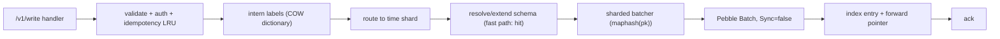

# 05 — Storage engine

## 1. Position

The engine is an embedded, single-process, sparse-column store over a
[Pebble](https://github.com/cockroachdb/pebble) LSM, with a covering range
index on a timestamp column. The design target is the shape this workload
actually has: a burst of tens of GiB written in minutes, then interactive
range-scan reads — validated in prior production use of this design at just
over 20 GiB ingested in under 10 minutes. Three properties are specific to
Mensura: a network write path in front of the engine, time-sharded sets so data
can be expired, and a configurable durability posture rather than a hard-wired
"throwaway" one.

Non-goals, unchanged: no network protocol *inside* the engine, no replication,
no backup, no TTL per row, no compound secondary indexes.

## 2. Data model

| Concept | Meaning |
| --- | --- |
| **Set** | A logical table. Rows are sparse: each row is a `map[column]Value`. |
| **Column** | Registered explicitly at set creation or implicitly on first write. Typed (`int64`, `float64`, `string`, `bool`, `bytes`). |
| **Indexed column** | At most one numeric column per set carries a primary range index — always `timestamp` for metric sets. |
| **Row** | One sample: `timestamp` + interned label columns + field columns. |
| **Primary key** | 16-byte xxh3-128, assigned by the write path ([04-wire-protocol.md §6](04-wire-protocol.md)). |

Sparseness is load-bearing: a set may have hundreds of columns while any given
row carries five, which is what lets one "set" hold a whole log format's worth
of extracted statistics without a wide-row penalty. `EXISTS` is therefore a
first-class predicate, distinct from "equals zero".

## 3. Keyspace

One Pebble instance stores everything under one-byte prefixes:

| Prefix | Contents |
| --- | --- |
| `M/` | Metadata: schemas, set-name ↔ set-ID map, set-ID counter, storage version, catalogue, retention state |
| `D/` | Unindexed sets: `D│be4(setID)│pk → row payload`.<br>Indexed sets: `D│be4(setID)│pk → be8(biased ts)` forward pointer |
| `I/` | Indexed sets only: `I│be4(setID)│be4(colID)│be8(biased ts)│pk → row payload` (covering) |
| `L/` | Label dictionaries: `L│key → entries record` |

Signed int64s are biased by XOR with `1<<63` before big-endian encoding, so
lexicographic byte order matches numeric order.

The payload is **clustered at the index key**, not behind a pk-keyed `D/`
entry. A time-range scan therefore iterates payload bytes in tight LSM order
with zero per-row point Gets — the property the whole read path is built on.
`Get(set, pk)`, `Update` and `Delete` follow the 8-byte `D/` forward pointer,
paying one extra point read on the rare read-modify-write path.

Row payload is a compact TLV with a jump-skip directory, so a projection of 3
columns out of 200 costs `O(columns)` varint decodes rather than `O(bytes)`.

## 4. Time sharding and retention

This is the one structural addition to the engine described above.

Continuous ingest needs expiry, and per-row TTL in an LSM means tombstones,
which means compaction debt exactly where the read path lives. Instead, sets
are **sharded by time**:

```
logical set:  http
physical sets: http@20260826, http@20260827, http@20260828 …
```

- Shard width is per-set (`retention.shard: 1d` default; `1h` for high-rate
  sets, `7d` for sparse ones).
- A write is routed to the shard containing its `ts_ms`. Writes far outside the
  retention window are rejected with `400 out of retention window` rather than
  creating an unbounded number of shards.
- A query resolves `[from, to]` to the set of shards it overlaps and runs one
  indexed scan per shard, merging by series. Shards are scanned in parallel up
  to `MaxConcurrentJobs`.
- Retention deletes a *whole shard*: a `DeleteRange` over `D│setID` and
  `I│setID`, plus removal of the schema entry. One range tombstone per shard
  instead of millions of point tombstones, and compaction reclaims it in one
  pass.
- `retention: none` (the batch-import default) creates a single shard and never
  expires.

Cost of sharding, stated plainly: a query spanning N days opens N iterators and
merges N streams, and a very small shard width on a low-rate set wastes an LSM
level's worth of overhead per shard. `1d` with an explicit override is the
compromise; `check`-style guidance lives in [09-operations.md](09-operations.md).

## 5. Write path



- Batches commit with `AssumeNew=true`: the caller promises either no row
  exists at that pk, or the existing row has the same indexed value. Content and
  offset key schemes both satisfy this by construction (the timestamp is part
  of the key input), so the orphaned-index-entry check
  (`IndexCanHaveOrphans`) stays off, which is worth ~6× on scan time.
- Writes to distinct keys proceed in parallel; same-key writes serialise on a
  256-way striped mutex so index maintenance is consistent.
- The column catalogue is maintained lock-free on the hot
  path: an atomic pointer to an immutable presence map, with rare additions
  taking a lock, copying, and publishing. Persisted at every checkpoint and at
  clean shutdown.

## 6. Read path

```go
it := d.Query("http@20260828").
    Between("timestamp", db.Int(fromMs), db.Int(toMs)).
    Where(db.And(
        db.In("host", db.Int(3), db.Int(7)),      // dictionary indices
        db.Exists("requests_total"),
    )).
    Project("timestamp", "host", "requests_total").
    Run(ctx)
```

- `Between` on the indexed column is a direct range seek. Rows lacking the
  indexed column have no index entry and are not visited.
- `Where` supports `Eq`, `In`, `Between`, `Exists`, `Not`, `And`, `Or`,
  evaluated against a lazy column accessor so only referenced columns decode.
- `Project` limits decoding to the requested columns.
- Every iterator pins a Pebble snapshot, giving a consistent point-in-time view
  while writers run. Iterators honour `ctx.Done()` between records, so a
  Grafana client disconnect unwinds the scan instead of finishing it.
- Iterators are not safe to share across goroutines; the query engine gives each
  shard scan its own.

Long-lived unclosed iterators prevent LSM space reclamation, so the query
engine wraps every iterator in a deferred close and the store exports
`open_iterators` as a health metric.

## 7. Durability

Batch import can safely run WAL-off and fsync-off, because the source files are
the truth and re-ingest is cheap. That is *a* mode, not *the* mode: follow and
receive ingest have no replayable source, so they get a WAL.

| Profile | `EnableWAL` | `SyncWrites` | Rationale |
| --- | --- | --- | --- |
| `batch` (one-shot import) | false | false | Source bundle is the truth; a crash means re-ingest. Fastest. |
| `stream` (default when any follow/receive client writes) | true | false | Group-commit WAL: a crash loses at most the last unsynced group, and ingest replays from its checkpoint anyway. |
| `paranoid` | true | true | Every batch fsynced. Roughly an order of magnitude slower on commit; for deployments with no upstream replay. |

`Close()` flushes memtables, so a clean shutdown is durable in all profiles.
The profile is a store-side config, not a per-request choice — mixing them
would make the ack meaningless.

Ack semantics: a `200` means committed to the memtable (and to the WAL when
enabled). It does not mean fsynced unless `paranoid`. This is documented in the
write API and is the contract the ingest checkpoint relies on.

## 8. Storage version

The layout version is written to `M/version`. Opening a directory whose version
differs from the build's returns `ErrStorageVersionMismatch`. There is no
in-place upgrade path: the recovery is wipe and re-ingest for batch
deployments, and for streaming deployments a documented dual-run window (new
store alongside old, ingest fanned out to both, old retired when its retention
window expires). Layout upgrades are rare and are announced in release notes
with the dual-run recipe.

## 9. Tunings

These numbers come from measured ingest and scan profiles, not from taste; the
reasoning is recorded next to each so a future change can argue with it.

| Option | Default | Why |
| --- | --- | --- |
| `CacheBytes` | 1 GiB | Indexed scans benefit ~linearly; every avoided block fetch is an avoided syscall plus decompression. `-1` disables entirely for scan-only workloads. |
| `MemTableSizeBytes` | 256 MiB | A batched writer fills 64 MiB trivially; 256 MiB amortises one flush across many commits and keeps ingest at memtable speed through bursts. |
| `MemTableStopWritesThreshold` | 4 | Pebble's default (2) stalls the writer whenever a flush is in flight; 4 lets the next batch land in a fresh memtable. Costs 2× memtable memory. |
| `MaxConcurrentCompactions` | 4 | Writing many sets in parallel makes 1 a bottleneck; 4 matches NVMe parallelism without starving foreground scan I/O. |
| `BlockSize` | 32 KiB (Pebble default 4 KiB) | The hot path is range scans where successive reads share a block: bigger blocks are nearly free on read and better on compression. |
| `EnableBloomFilter` | on for network-FS profiles | Makes negative point lookups free; ~1.25 % on-disk overhead. |
| `Compression` | `balanced` | Fastest compression on upper levels, zstd-1 on the bottom levels where the bytes settle. |
| `TargetFileSizeL0` | 32–64 MiB on network FS | With 2 MiB targets, a large memtable flush creates ~500 files, each paying 2–3 metadata round-trips (~60–90 ms each on EFS-like storage). |
| `BytesPerSync` | disabled on network FS | Each periodic `sync_file_range` becomes a synchronous COMMIT RPC (~30 ms) on NFS/EFS. |
| `LBaseMaxBytes` | raised on network FS | Amortises L0→LBase compaction over more keys, cutting total compactions. |
| `L0StopWritesThreshold` | 30–50 on network FS | Absorbs L0 buildup during slow-storage moments instead of stalling ingest. |
| `PostIngestCompact` | on for `batch` | A full compaction after import typically shrinks the store 30–50 % and makes the first queries land on one dense level. |

Two named profiles ship (`--storage-profile local|network-fs`) that set these
as a group; individual knobs override. A `network-fs` profile that detects a
local block device at startup logs a warning, and vice versa.

## 10. Sizing

Rules of thumb for capacity planning, to be replaced by measurements from the
benchmark suite ([11-roadmap.md](11-roadmap.md)):

- **Per row on disk**: ~40–80 bytes after compression for a typical row of one
  timestamp, 3 interned labels and 4 numeric fields. A stream emitting one
  sample per second per host with 4 fields is ~5–7 MiB/day/host.
- **Memory**: block cache (default 1 GiB) + memtables (`MemTableSize ×
  (StopWritesThreshold + 1)`, ~1.25 GiB at defaults) + dictionary (a few MiB at
  sane cardinality) + per-query series buffers.
- **Query buffers**: the render pipeline buffers a full series before sorting,
  so peak memory is proportional to the *widest* series in the range, not to
  the whole result. The `MaxDataPointsReceived` gate (default 34.56 M) is what
  bounds the pathological case; its default is sized so four concurrent panels
  rendering 1 000 series for a day fit in roughly 4 GiB.

## 11. Statistics

`GET /v1/stats` exposes puts, deletes, gets, scans, queries, open iterators,
plus Pebble's own metrics (cache hit rate, compaction debt, disk usage, L0
sublevels). These are also exported as Prometheus metrics. Two are worth
alerting on: `open_iterators` trending up (a leak, and a space-reclamation
stall) and L0 sublevel count approaching `L0StopWritesThreshold` (writes are
about to stall).

## 12. Naming and reserved identifiers

Identifiers are validated at the write path, not at query time, so a bad name
fails at the source rather than confusing a panel author later.

| Kind | Rule |
| --- | --- |
| Set name | `[A-Za-z_][A-Za-z0-9_.-]{0,127}`; case-sensitive |
| Field name | `[A-Za-z_][A-Za-z0-9_.-]{0,127}`; case-sensitive |
| Label key | same as field name |
| Label value | any UTF-8, ≤ 1 KiB, not empty |
| Reserved prefix | `_mensura` on sets, fields and label keys; rejected from clients |
| Reserved field | `timestamp` — the indexed column on every metric set; a spec that produces a `timestamp` field is a validation error |

Shard suffixes are appended by the store, never by clients: `set@YYYYMMDD` for
day shards, `set@YYYYMMDDHH` for hour shards, `set@all` for `retention: none`.
`@` is therefore excluded from the set-name charset, which is what keeps the
physical and logical namespaces from colliding.

Internal sets, all under the reserved prefix and all writable only by the store
itself:

| Set | Contents |
| --- | --- |
| `_mensura_catalogue` | Sets, fields, field metadata, bucket sets, conflicts, `catalogue_version` |
| `_mensura_labels` | One row per label key: the ordered dictionary of its values |
| `_mensura_ingest` | Ingest progress samples (see below) |

`_mensura_ingest` is a normal metric set, so ingest health is queryable with
ordinary MQL. Its labels are `client`, `input`, `stream`; its fields are
`bytes_read`, `records`, `samples`, `unmatched_lines`, `ts_parse_errors`,
`batches_sent`, `batches_retried`, `batches_dropped`, `lag_bytes`,
`udp_dropped`, `files_total`, `files_done`. Clients may write it despite the
reserved prefix — it is the one exception, and it is allowed only for samples
carrying the client's own `client` label.
