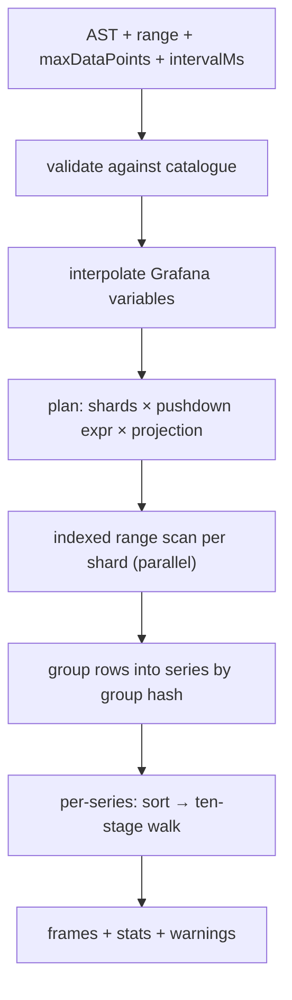

# 06 — MQL, the query language

## 1. Why a new language

AGI had no query language. A panel was a JSON payload of sets, bins, filters,
group-bys and per-bin flags, hand-edited inside a SimpleJson datasource. That
was workable for a fixed dashboard library and hostile to anyone building a
panel from scratch.

MQL replaces it with three requirements:

1. **Lossless builder round-trip.** Every query expressible in text is
   expressible in the visual builder and vice versa. There is no "you have used
   an advanced feature, the builder is now disabled" cliff.
2. **No hidden behaviour.** Nothing about how a series is transformed is
   implicit. In particular the looseness AGI had — a filter that silently
   matched rows missing the column, a dropped filter clause when a dictionary
   value was unknown — becomes explicit syntax.
3. **Declarative modifiers, fixed execution order.** Transform order is part of
   the correctness contract (whitepaper §5.6). MQL therefore does *not* offer a
   composable function algebra where `rate(clamp(x))` differs from
   `clamp(rate(x))`. Modifiers set flags; the engine applies them in the one
   canonical order. Writing them in a misleading order is a lint warning, never
   a semantic change.

The canonical form is the **AST** (JSON). Text is a surface syntax that parses
to the AST and prints back from it. Grafana panels store the AST, so a text
grammar change can never break a saved dashboard.

## 2. Shape

```mql
FROM   <set>
SELECT <field-expr> [, <field-expr> …]
[WHERE  <predicate>]
[BY     <label> [, <label> …]]
[EVERY  <duration>]
[FORMAT timeseries | table | heatmap | logs]
[LIMIT  SERIES <n> | POINTS <n>]
```

Clause order is fixed and each clause appears at most once. `FROM` and `SELECT`
are required; everything else has a defined default.

A worked example:

```mql
FROM http
SELECT requests_total RATE GAP 30s AS "req/s",
       errors_total   RATE GAP 30s AS "err/s",
       inflight       AS "in flight"
WHERE  host IN ($host) AND dc = "eu-west-1" AND HAS requests_total
BY     host
FORMAT timeseries
```

## 3. Grammar

```ebnf
query        = "FROM" set
               "SELECT" field-expr { "," field-expr }
               [ "WHERE" predicate ]
               [ "BY" label { "," label } ]
               [ "EVERY" duration ]
               [ "FORMAT" format ]
               [ "LIMIT" limit { "," limit } ] ;

set          = ident | string ;
field-expr   = field { modifier } [ "AS" string ] ;
field        = ident | string | histogram-call ;
histogram-call = "HISTOGRAM" "(" ident ")" ;

modifier     = "DELTA"
             | "PER" "SECOND"
             | "RATE"                             (* sugar: DELTA PER SECOND *)
             | "NEGATE"
             | "REQUIRED"
             | "GAP" duration
             | "SSE" ( number | "REPEAT" | "OFF" )
             | "CLAMP" clamp-spec { "," clamp-spec } [ "ELSE" ( "RAW" | "BOUND" ) ] ;
clamp-spec   = ( "MIN" | "MAX" ) number ;

predicate    = or-expr ;
or-expr      = and-expr { "OR" and-expr } ;
and-expr     = unary { "AND" unary } ;
unary        = [ "NOT" ] ( "(" predicate ")" | comparison | existence ) ;
comparison   = label ( "=" | "!=" ) value
             | label "IN" "(" value { "," value } ")"
             | label "=~" regex
             | label "!~" regex ;
existence    = "HAS" ident | "MISSING" ident ;

value        = string | number | variable ;
variable     = "$" ident | "${" ident "}" ;
format       = "timeseries" | "table" | "heatmap" | "logs" ;
limit        = "SERIES" number | "POINTS" number ;
duration     = number ( "ms" | "s" | "m" | "h" | "d" ) ;
```

Keywords are case-insensitive; identifiers are case-sensitive. Identifiers that
collide with keywords or contain non-word characters are double-quoted.

Comments: `--` to end of line.

## 4. Semantics

### 4.1 `FROM`

Names a logical set. The planner expands it to the time shards overlapping the
panel's range ([05-storage.md §4](05-storage.md)). A non-existent set is an
error at validation time, listing the near-miss candidates.

### 4.2 `SELECT`

Each `field-expr` produces one *series family*: one series per distinct `BY`
tuple. Fields are columns on the set; a row that lacks the column contributes
nothing (sparse rows are the norm).

`AS` sets the display name; the default is the field name. Legend composition
is `BY`-values joined with the configured separator, with the display name
first or last per datasource setting — carried from AGI so existing dashboard
conventions survive.

### 4.3 Modifiers

| Modifier | Effect | Pipeline stage |
| --- | --- | --- |
| `DELTA` | Treat as a monotonic counter; emit per-sample differences. The first sample seeds the previous value and emits nothing. | 4 |
| `PER SECOND` | Divide by the raw elapsed seconds between this and the previous sample. | 7 |
| `RATE` | Sugar for `DELTA PER SECOND`. | 4 + 7 |
| `NEGATE` | Multiply by −1 after delta conversion. Mirrored-axis panels. | 5 |
| `CLAMP MIN a, MAX b [ELSE RAW\|BOUND]` | Range clamp. `ELSE RAW` (default when field metadata declares limits) substitutes the raw pre-transform sample — the counter-reset escape hatch. `ELSE BOUND` clamps to the bound. | 6 |
| `GAP d` | Declared ticker cadence. Two consecutive samples further apart than `d` produce a null connect-break one millisecond before the later sample. Default: the field's `max_interval` metadata; `GAP 0` disables. | 1 |
| `SSE n\|REPEAT\|OFF` | Singular-series extension for a series that renders as one point. Default `0`. | tail |
| `REQUIRED` | Fail the query up front if the field is absent from the catalogue, instead of drawing nothing. | plan |

The stage numbers refer to [07-downsampling.md](07-downsampling.md) and are the
whole point: the modifiers *are* the per-bin control surface from the
whitepaper's Appendix B, given a syntax.

Order independence is enforced by the parser: modifiers are collected into a
set, duplicates are an error, and the printer emits them in canonical order, so
`x PER SECOND DELTA` prints back as `x RATE`. A query written in a misleading
order produces the lint `W101: modifiers are applied in canonical order
(DELTA → NEGATE → CLAMP → PER SECOND); written order is ignored`.

### 4.4 `WHERE`

Predicates address **labels** (interned strings) and field presence.

- `label = "v"` matches rows that carry `label` with that value. A row missing
  the label does **not** match. This is the change from AGI, where a filter
  without `MustExist` matched rows lacking the column; that looseness was there
  to keep panels rendering during ingest, and it silently widened queries. To
  ask for it explicitly: `host = "web1" OR MISSING host`.
- `label =~ /re/` is a regex match, evaluated against the dictionary once per
  query (producing an `IN` of the matching indices), not per row. An unanchored
  pattern that matches every value is folded away entirely.
- A value not present in the dictionary makes that comparison a constant
  `false`, which is propagated: `host = "typo"` returns an empty result with the
  warning `W201: no values match host = "typo"`. AGI dropped the clause and
  returned everything, which is a wrong graph and a bad night.
- `HAS field` / `MISSING field` map to the engine's `Exists` predicate.
- Everything is pushed down to the engine's filter evaluator; nothing is
  filtered in the render layer.

### 4.5 `BY`

Group-by labels. The series identity is the ordered tuple of `BY` values plus
the field's display name, hashed to a stable group hash. Labels with an empty
value are omitted from the legend but still distinguish series.

No `BY` means one series per field, aggregating all matching rows into a single
series — with the honest caveat in §8.

### 4.6 `EVERY`

Overrides the automatic downsample window. Default is the whitepaper's

```
window = min(rangeMs / maxDataPoints, intervalMs) × 2
```

`EVERY` is what alerting rules and exports use, where "however many pixels the
panel has" is not a sane input.

### 4.7 `FORMAT`

| Format | Output |
| --- | --- |
| `timeseries` | One frame per series, time + nullable value. The default. |
| `table` | One frame, one column per selected field plus label columns. No downsampling, no gap injection; `LIMIT POINTS` applies. |
| `heatmap` | One frame per bucket-set series with bucket-edge fields; see §6. |
| `logs` | Raw rows in time order with their string fields, for a logs panel. Requires `LIMIT POINTS` (default 1 000). |

### 4.8 `LIMIT`

`LIMIT SERIES n` and `LIMIT POINTS n` override the datasource safety gates
downward. They cannot raise a limit above the datasource maximum; that requires
a datasource setting change, deliberately.

## 5. Auxiliary query forms

For variables, autocomplete and exploration:

```mql
SETS                                   -- every set
FIELDS FROM http                       -- fields + metadata for a set
LABELS host WHERE dc = "eu-west-1"     -- dictionary values, optionally filtered
LABEL KEYS FROM http                   -- label keys present on a set
```

These are the backing endpoints for Grafana variable queries and are cheap:
`SETS`, `FIELDS` and `LABEL KEYS` are catalogue reads; `LABELS` is a dictionary
read plus an optional filter scan.

## 6. Histograms and heatmaps

A bucket set declared at ingest ([03-extraction.md §8](03-extraction.md)) is
addressed as one unit:

```mql
FROM latency
SELECT HISTOGRAM(hdr24) AS "op latency"
WHERE app = "api" AND host IN ($host)
BY host
FORMAT heatmap
```

`HISTOGRAM(name)` expands to the bucket-set's member fields, sums counts per
bucket per window, and emits a heatmap frame with real numeric bucket edges
from the declaration. Grouping by a label yields one heatmap per group — AGI
merged all nodes into one histogram and documented it as a limitation; here it
is just a `BY`.

With `FORMAT timeseries`, `HISTOGRAM(hdr24) PERCENTILE 99` emits an estimated
p99 series computed from the cumulative buckets (linear interpolation within
the containing bucket, edges from the declaration). The estimate's error bound
is a function of bucket width and is reported in the frame's metadata rather
than being quietly presented as exact.

## 7. The AST

The wire form. The builder emits it, the text parser produces it, the printer
consumes it.

```json
{
  "from": "http",
  "select": [
    {
      "field": "requests_total",
      "as": "req/s",
      "modifiers": {
        "delta": true,
        "perSecond": true,
        "negate": false,
        "required": false,
        "gapMs": 30000,
        "clamp": {"min": 0, "else": "raw"},
        "sse": {"mode": "const", "value": 0}
      }
    }
  ],
  "where": {
    "and": [
      {"in": {"label": "host", "values": ["web1", "web2"]}},
      {"eq": {"label": "dc", "value": "eu-west-1"}},
      {"has": "requests_total"}
    ]
  },
  "by": ["host"],
  "everyMs": null,
  "format": "timeseries",
  "limits": {"series": null, "points": null}
}
```

Properties that are tested, not merely intended:

- `parse(print(ast)) == ast` for every AST the builder can produce;
- `print(parse(text))` is stable (idempotent) and canonically ordered;
- the AST validates against a published JSON Schema, and unknown fields are
  rejected — a typo must fail loudly rather than silently changing a panel.

## 8. Execution



1. **Validate** — sets, fields, labels exist; modifiers legal for the field
   kind; limits within datasource maxima. Warnings (counter without `RATE`,
   regex matching everything, missing `GAP` on a field with no metadata) are
   collected, not fatal.
2. **Interpolate** — Grafana variables become literal values. A multi-value
   variable becomes `IN (…)`; a variable resolving to `All` removes its
   comparison entirely; a variable resolving to the sentinel `NONE` short-
   circuits the whole query to an empty result (carried from AGI, where
   dashboards use `NONE` as a deliberate "draw nothing" choice).
3. **Plan** — resolve shards, build one pushdown expression, and compute the
   projection: timestamp column + selected fields + `BY` labels + labels
   referenced by predicates. Nothing else is decoded.
4. **Scan** — one iterator per shard, in parallel, each honouring the request
   context so a Grafana disconnect unwinds immediately.
5. **Group** — a stable hash over the sorted `BY` values plus the display name.
   Series are looked up in a map (AGI used a linear scan; at 1 000 series that
   is measurable).
6. **Render** — sort each series by timestamp, run the ten-stage walk.
7. **Emit** — one frame per series, plus stats and warnings.

Aggregation caveat, stated rather than hidden: with no `BY`, rows from many
streams land in one series, and where two streams report at the same
millisecond the duplicate-timestamp rule (stage 2) keeps the first and drops
the rest. This is correct for a single-stream series and misleading for a
multi-stream one, so validation emits `W301: no BY clause with multiple
streams in range; series will interleave, consider BY host`. A future
`AGGREGATE sum|avg|max BY …` clause (roadmap M5) is the real fix; until then
the language tells the truth about what it does.

## 9. Safety gates

Carried from AGI, with the partial-result behaviour intact:

| Gate | Default | On trip |
| --- | --- | --- |
| `MaxSeriesPerGraph` | 1 000 | Return the series collected so far plus the error "too many series; narrow filters or add BY" |
| `MaxDataPointsReceived` | 34 560 000 | Return partial data plus "too many datapoints; zoom in or filter" |
| Per-query wall clock | none (client context governs) | Client disconnect unwinds the scan |
| `LIMIT POINTS` (table/logs) | 1 000 | Truncate, flag `truncated: true` |

Both size gates can be disabled per query via datasource-level toggles exposed
as dashboard variables, exactly as AGI did, because during an incident the
operator sometimes genuinely wants the expensive query.

## 10. Mapping from AGI payloads

For anyone porting an AGI dashboard:

| AGI payload field | MQL |
| --- | --- |
| `target` (set name) | `FROM set` |
| `bins[].name` | `SELECT field` |
| `bins[].displayName` | `AS "…"` |
| `bins[].produceDelta` | `DELTA` |
| `bins[].convertToPerSecond` | `PER SECOND` |
| `bins[].reverse` | `NEGATE` |
| `bins[].maxIntervalSeconds` | `GAP <d>s` |
| `bins[].limits{minValue,maxValue,replaceWithOriginal}` | `CLAMP MIN a, MAX b ELSE RAW\|BOUND` |
| `bins[].singlarSeriesExtend` | `SSE n\|REPEAT\|OFF` |
| `bins[].required` | `REQUIRED` |
| `filterBy[]` with `mustExist:true` | `label IN (…)` |
| `filterBy[]` with `mustExist:false` | `label IN (…) OR MISSING label` |
| `groupBy[]` | `BY …` |
| `payload.type` | `FORMAT …` |
| `/histogram` endpoint | `HISTOGRAM(bucketset)` + `FORMAT heatmap` |

A `mensura-ingest convert --agi-dashboard f.json` helper performs this
mechanically and reports anything it could not translate, rather than guessing.
