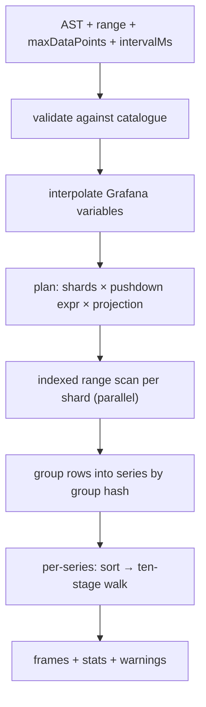

# 06 — MQL, the query language

## 1. Why a new language

The obvious cheap option is to have no query language at all: let a panel carry
a JSON payload of sets, fields, filters, group-bys and per-field flags, typed
by hand into a generic JSON datasource. That is workable for a fixed dashboard
library and hostile to anyone building a panel from scratch.

MQL exists instead, under three requirements:

1. **Lossless builder round-trip.** Every query expressible in text is
   expressible in the visual builder and vice versa. There is no "you have used
   an advanced feature, the builder is now disabled" cliff.
2. **No hidden behaviour.** Nothing about how a series is transformed is
   implicit. The two classic forms of convenient looseness — a filter that
   silently matches rows missing the column, and a filter clause quietly dropped
   because its value is unknown — become explicit syntax instead.
3. **Declarative modifiers, fixed execution order.** Transform order is part of
   the correctness contract (whitepaper §5.6). MQL therefore does *not* offer a
   composable function algebra where `rate(clamp(x))` differs from
   `clamp(rate(x))`. Modifiers set flags; the engine applies them in the one
   canonical order. Writing them in a misleading order is a lint warning, never
   a semantic change.

The canonical form is the **AST** (JSON). Text is a surface syntax that parses
to the AST and prints back from it. Grafana panels store the AST, so a text
grammar change can never break a saved dashboard.

## 2. Shape

```mql
FROM   <set>
SELECT <field-expr> [, <field-expr> …]
[WHERE  <predicate>]
[BY     <label> [, <label> …]]
[EVERY  <duration>]
[FORMAT timeseries | table | heatmap | logs]
[LIMIT  SERIES <n> | POINTS <n>]
```

Clause order is fixed and each clause appears at most once. `FROM` and `SELECT`
are required; everything else has a defined default.

A worked example:

```mql
FROM http
SELECT requests_total RATE GAP 30s AS "req/s",
       errors_total   RATE GAP 30s AS "err/s",
       inflight       AS "in flight"
WHERE  host IN ($host) AND dc = "eu-west-1" AND HAS requests_total
BY     host
FORMAT timeseries
```

## 3. Grammar

```ebnf
query        = "FROM" set
               "SELECT" field-expr { "," field-expr }
               [ "WHERE" predicate ]
               [ "BY" label { "," label } ]
               [ "EVERY" duration ]
               [ "FORMAT" format ]
               [ "LIMIT" limit { "," limit } ] ;

set          = ident | string ;
field-expr   = field { modifier } [ "AS" string ] ;
field        = ident | string | histogram-call ;
histogram-call = "HISTOGRAM" "(" ident ")" ;

modifier     = "DELTA"
             | "PER" "SECOND"
             | "RATE"                             (* sugar: DELTA PER SECOND *)
             | "NEGATE"
             | "REQUIRED"
             | "GAP" duration
             | "SSE" ( number | "REPEAT" | "OFF" )
             | "CLAMP" clamp-spec { "," clamp-spec } [ "ELSE" ( "RAW" | "BOUND" ) ] ;
clamp-spec   = ( "MIN" | "MAX" ) number ;

(* The CLAMP bound list nests inside the comma-separated SELECT list, so
   a comma continues the CLAMP only when MIN or MAX follows it: the
   parser takes one token of lookahead there. `SELECT cpu CLAMP MIN 0,
   mem` is two fields; `SELECT cpu CLAMP MIN 0, MAX 100` is one.
   12-implementation.md section 6.76. *)

predicate    = or-expr ;
or-expr      = and-expr { "OR" and-expr } ;
and-expr     = unary { "AND" unary } ;
unary        = [ "NOT" ] ( "(" predicate ")" | comparison | existence ) ;
comparison   = label ( "=" | "!=" ) value
             | label "IN" "(" value { "," value } ")"
             | label "=~" regex
             | label "!~" regex ;
existence    = "HAS" ident | "MISSING" ident ;

value        = string | number | variable ;
variable     = "$" ident | "${" ident "}" ;
format       = "timeseries" | "table" | "heatmap" | "logs" ;
limit        = "SERIES" number | "POINTS" number ;
duration     = number ( "ms" | "s" | "m" | "h" | "d" ) | "0" ;
```

Keywords are case-insensitive; identifiers are case-sensitive. Identifiers that
collide with keywords or contain non-word characters are double-quoted.

A bare `0` is the one duration written without a unit, because every unit
gives the same answer; it is also what the printer emits for a zero, so
`GAP 0` round-trips. `mql.ParseDuration`, which is what the extraction
spec reads `retention:`, `shard:` and `max_interval:` through, reads the
same language.

Comments: `--` to end of line.

Two bounds apply to the text and to the AST alike, because the parser is
recursive descent and a Go stack overflow is a fatal runtime error rather
than a recoverable panic: a query may be at most 1 MiB, and a `WHERE`
predicate may nest at most 64 levels. The deepest predicate in this
document is three. The AST is held to the same depth by the validator, so
an AST that validates is one `Print` can render and the parser can read
back ([12](12-implementation.md) §6.118).

## 4. Semantics

### 4.1 `FROM`

Names a logical set. The planner expands it to the time shards overlapping the
panel's range ([05-storage.md §4](05-storage.md)). A non-existent set is an
error at validation time, listing the near-miss candidates.

### 4.2 `SELECT`

Each `field-expr` produces one *series family*: one series per distinct `BY`
tuple. Fields are columns on the set; a row that lacks the column contributes
nothing (sparse rows are the norm).

`AS` sets the display name; the default is the field name. Legend composition
is `BY`-values joined with the configured separator, with the display name
first or last per datasource setting.

### 4.3 Modifiers

| Modifier | Effect | Pipeline stage |
| --- | --- | --- |
| `DELTA` | Treat as a monotonic counter; emit per-sample differences. The first sample seeds the previous value and emits nothing. | 4 |
| `PER SECOND` | Divide by the raw elapsed seconds between this and the previous sample. | 7 |
| `RATE` | Sugar for `DELTA PER SECOND`. | 4 + 7 |
| `NEGATE` | Multiply by −1 after delta conversion. Mirrored-axis panels. | 5 |
| `CLAMP MIN a, MAX b [ELSE RAW\|BOUND]` | Range clamp. `ELSE RAW` (default when field metadata declares limits) substitutes the raw pre-transform sample — the counter-reset escape hatch. `ELSE BOUND` clamps to the bound. | 6 |
| `GAP d` | Declared ticker cadence. Two consecutive samples further apart than `d` produce a null connect-break one millisecond before the later sample. Default: the field's `max_interval` metadata; `GAP 0` disables. | 1 |
| `SSE n\|REPEAT\|OFF` | Singular-series extension for a series that renders as one point. Default `0`. | tail |
| `REQUIRED` | Fail the query up front if the field is absent from the catalogue, instead of drawing nothing. | plan |

The stage numbers refer to [07-downsampling.md](07-downsampling.md) and are the
whole point: the modifiers *are* the per-bin control surface from the
whitepaper's Appendix B, given a syntax.

Order independence is enforced by the parser: modifiers are collected into a
set, duplicates are an error, and the printer emits them in canonical order, so
`x PER SECOND DELTA` prints back as `x RATE`. A query written in a misleading
order produces the lint `W101`, naming the field: modifiers are applied in the
canonical order `DELTA`/`PER SECOND` → `NEGATE` → `CLAMP` → `GAP` → `SSE` →
`REQUIRED` whatever order they are written in, and that is the order the query
prints back as. (The order above is the printer's, which is what makes the
canonical *text*; the execution stages it corresponds to are in
[07-downsampling.md](07-downsampling.md) §3, and `PER SECOND` runs after
`CLAMP` there.) The lint is a property of the text rather than of the AST —
modifiers are a set, so the written order does not survive parsing — so it
comes from `mql.ParseDiags` rather than from validation, and reaches the
editor through the `parse` endpoint's warnings.

### 4.4 `WHERE`

Predicates address **labels** (interned strings) and field presence.

- `label = "v"` matches rows that carry `label` with that value. A row missing
  the label does **not** match. The looser reading — matching rows that lack the
  label — keeps panels rendering while ingest is still populating, and silently
  widens every query that uses it. To ask for it explicitly:
  `host = "web1" OR MISSING host`.
- `label =~ /re/` is a regex match, evaluated against the dictionary once per
  query (producing an `IN` of the matching indices), not per row. An unanchored
  pattern that matches every value is folded away entirely.
- A value not present in the dictionary makes that comparison a constant
  `false`, which is propagated: `host = "typo"` returns an empty result with the
  warning `W201: no values match host = "typo"`. The alternative — dropping the
  clause and returning everything — turns a typo into a wrong graph at 03:00.
- `HAS field` / `MISSING field` map to the engine's `Exists` predicate, which
  reads a column off the row. A row's columns are its labels and its fields
  alike, so either may be named; a name that is neither is `E004`.
- Everything is pushed down to the engine's filter evaluator; nothing is
  filtered in the render layer.

### 4.5 `BY`

Group-by labels. A key the set's catalogue does not carry is `E004`, not a
silently merged series: no row holds it, so grouping by it would put every
row in one slot. The series identity is the ordered tuple of `BY` values plus
the field's display name, hashed to a stable group hash. Labels with an empty
value are omitted from the legend but still distinguish series.

No `BY` means one series per field, aggregating all matching rows into a single
series — with the honest caveat in §8.

### 4.6 `EVERY`

Overrides the automatic downsample window. Default is the whitepaper's

```
window = min(rangeMs / maxDataPoints, intervalMs) × 2
```

`EVERY` is what alerting rules and exports use, where "however many pixels the
panel has" is not a sane input.

It is a downsample window, so it is only meaningful where there is a walk to
window: `FORMAT timeseries` and `FORMAT heatmap`. Under `FORMAT table` or
`FORMAT logs` it is refused (`E008`) rather than accepted and dropped — the
tabular executor never reads it, and a clause that silently does nothing is
the failure the timeseries-only-modifier rule below exists to prevent one
clause further in.

### 4.7 `FORMAT`

| Format | Output |
| --- | --- |
| `timeseries` | One frame per series, time + nullable value. The default. |
| `table` | One frame, one column per selected field plus label columns. No downsampling, no gap injection; `LIMIT POINTS` applies. |
| `heatmap` | One frame per bucket-set series with bucket-edge fields; see §6. |
| `logs` | Raw rows in time order with their string fields, for a logs panel. Requires `LIMIT POINTS` (default 1 000). |

### 4.8 `LIMIT`

`LIMIT SERIES n` and `LIMIT POINTS n` override the datasource safety gates
downward. They cannot raise a limit above the datasource maximum; that requires
a datasource setting change, deliberately.

`LIMIT SERIES` bounds a series count, so it applies to `FORMAT timeseries` and
`FORMAT heatmap`. A tabular format produces rows rather than series and is
bounded by `LIMIT POINTS`, so `LIMIT SERIES` under `FORMAT table` or
`FORMAT logs` is refused (`E008`) rather than ignored.

## 5. Auxiliary query forms

For variables, autocomplete and exploration:

```mql
SETS                                   -- every set
FIELDS FROM http                       -- fields + metadata for a set
LABELS host WHERE dc = "eu-west-1"     -- dictionary values, optionally filtered
LABEL KEYS FROM http                   -- label keys present on a set
```

These are the backing endpoints for Grafana variable queries and are cheap:
`SETS`, `FIELDS` and `LABEL KEYS` are catalogue reads; `LABELS` is a dictionary
read plus an optional filter scan. The filter scan is bounded by the same two
size gates as a graph (§9): it walks every set carrying the label across the
whole range, and a dashboard refreshes its variables on every load.

## 6. Histograms and heatmaps

A bucket set declared at ingest ([03-extraction.md §8](03-extraction.md)) is
addressed as one unit:

```mql
FROM latency
SELECT HISTOGRAM(hdr24) AS "op latency"
WHERE app = "api" AND host IN ($host)
BY host
FORMAT heatmap
```

`HISTOGRAM(name)` expands to the bucket-set's member fields, sums counts per
bucket per window, and emits a heatmap frame with real numeric bucket edges
from the declaration. A column is one summed value, so the window is the
undoubled width of [07](07-downsampling.md) §2 rather than the min/max
pair's; `EVERY` overrides it as it does everywhere else. Bucket counts are reduced by **sum**, not by the min/max
walk: a line asks what the extreme was, a heatmap column asks how many fell in
the bucket ([12-implementation.md §6.4](12-implementation.md)). Grouping by a label yields one heatmap per group, so
"per host" is a `BY` clause rather than a feature request.

`HISTOGRAM(name)` is only meaningful under `FORMAT heatmap`, and the
validator refuses it anywhere else (`E008`) rather than planning a query with
no series in it: a bucket set resolves to no plottable field, so the panel
would come back empty with nothing to explain why.

For the same reason a bucket set carries no per-field modifier. `RATE`,
`DELTA`, `NEGATE`, `CLAMP`, `GAP`, `SSE` and `REQUIRED` are all properties of
the render walk, and the heatmap executor does not run one: it sums bucket
counts per window. They used to be accepted and dropped in silence, so
`HISTOGRAM(hdr24) RATE` drew raw counts under a legend the author read as a
rate; they are now `E008`. `AS` is not a modifier and still names the series.

With `FORMAT timeseries`, `HISTOGRAM(hdr24) PERCENTILE 99` (planned for M5,
not yet implemented) emits an estimated
p99 series computed from the cumulative buckets (linear interpolation within
the containing bucket, edges from the declaration). The estimate's error bound
is a function of bucket width and is reported in the frame's metadata rather
than being quietly presented as exact.

## 7. The AST

The wire form. The builder emits it, the text parser produces it, the printer
consumes it.

```json
{
  "from": "http",
  "select": [
    {
      "field": "requests_total",
      "as": "req/s",
      "modifiers": {
        "delta": true,
        "perSecond": true,
        "negate": false,
        "required": false,
        "gapMs": 30000,
        "clamp": {"min": 0, "else": "raw"},
        "sse": {"mode": "const", "value": 0}
      }
    }
  ],
  "where": {
    "and": [
      {"in": {"label": "host", "values": ["web1", "web2"]}},
      {"eq": {"label": "dc", "value": "eu-west-1"}},
      {"has": "requests_total"}
    ]
  },
  "by": ["host"],
  "everyMs": null,
  "format": "timeseries",
  "limits": {"series": null, "points": null}
}
```

Properties that are tested, not merely intended:

- `parse(print(ast)) == ast` for every AST the builder can produce;
- `print(parse(text))` is stable (idempotent) and canonically ordered;
- the AST validates against a published JSON Schema, and unknown fields are
  rejected — a typo must fail loudly rather than silently changing a panel.

## 8. Execution



1. **Validate** — sets, fields, labels exist; modifiers legal for the field
   kind; limits within datasource maxima. Warnings (counter without `RATE`,
   regex matching everything, missing `GAP` on a field with no metadata) are
   collected, not fatal.
2. **Interpolate** — Grafana variables become literal values. A multi-value
   variable becomes `IN (…)`; a variable resolving to `All` removes its
   comparison entirely; a variable resolving to the sentinel `NONE` short-
   circuits the whole query to an empty result, which is how a dashboard offers
   "draw nothing" as a deliberate dropdown choice.
3. **Plan** — resolve shards, build one pushdown expression, and compute the
   projection: timestamp column + selected fields + `BY` labels + labels
   referenced by predicates. Nothing else is decoded.
4. **Scan** — one iterator per shard, in parallel, each honouring the request
   context so a Grafana disconnect unwinds immediately.
5. **Group** — a stable hash over the sorted `BY` values plus the display name.
   Series are looked up in a map: a linear scan over the response slice is
   measurable at the 1 000-series safety limit.
6. **Render** — sort each series by timestamp, run the ten-stage walk.
7. **Emit** — one frame per series, plus stats and warnings.

Aggregation caveat, stated rather than hidden: with no `BY`, rows from many
streams land in one series, and where two streams report at the same
millisecond the duplicate-timestamp rule (stage 2) keeps the first and drops
the rest. This is correct for a single-stream series and misleading for a
multi-stream one, so the executor emits `W301` whenever the walk actually
dropped a sample that way, saying how many and — with no `BY` clause — naming
the set's own label keys to group by. It is the loss itself that is reported,
not a guess from the shape of the query: the count is taken after the walk has
sorted the series, so it is the number of samples that really did collapse. A
future `AGGREGATE sum|avg|max BY …` clause (roadmap M5) is the real fix; until
then the language tells the truth about what it does.

## 9. Safety gates

The partial-result behaviour is part of the contract:

| Gate | Default | On trip |
| --- | --- | --- |
| `MaxSeriesPerGraph` | 1 000 | Return the series collected so far plus the error "too many series; narrow filters or add BY" |
| `MaxDataPointsReceived` | 34 560 000 | Return partial data plus "too many datapoints; zoom in or filter" |
| Per-query wall clock | none (client context governs) | Client disconnect unwinds the scan |
| `LIMIT POINTS` (table/logs) | 1 000 | Truncate, flag `truncated: true`, and return the error plus `W401` — a table that silently shows the first rows of a range is indistinguishable from one that shows all of them |

Truncation keeps what the format promises: the newest rows under `FORMAT
logs`, the oldest under `FORMAT table`. The walk normally reaches them by
reading shards in time order and stopping as soon as it has enough, which
is only sound while a set's shards are disjoint — see
[05](05-storage.md) §7.1 for the two configuration changes that make them
overlap. Where they do, the scan reads the whole range and keeps the
right rows instead; the memory it holds is still bounded by the limit.
| `LABELS <key> WHERE …` filter scan | the two size gates above | Return the values collected so far plus the error and `W401` |

Both size gates can be disabled per query via datasource-level toggles exposed
as dashboard variables, because during an incident the operator sometimes
genuinely wants the expensive query.

## 10. Mapping from flag-style panel payloads

For anyone porting a dashboard from a datasource whose panels carry per-field
flags as JSON, the correspondence is mechanical:

| Payload field | MQL |
| --- | --- |
| `target` (set name) | `FROM set` |
| `bins[].name` | `SELECT field` |
| `bins[].displayName` | `AS "…"` |
| `bins[].produceDelta` | `DELTA` |
| `bins[].convertToPerSecond` | `PER SECOND` |
| `bins[].reverse` | `NEGATE` |
| `bins[].maxIntervalSeconds` | `GAP <d>s` |
| `bins[].limits{minValue,maxValue,replaceWithOriginal}` | `CLAMP MIN a, MAX b ELSE RAW\|BOUND` |
| `bins[].singlarSeriesExtend` | `SSE n\|REPEAT\|OFF` |
| `bins[].required` | `REQUIRED` |
| `filterBy[]` with `mustExist:true` | `label IN (…)` |
| `filterBy[]` with `mustExist:false` | `label IN (…) OR MISSING label` |
| `groupBy[]` | `BY …` |
| `payload.type` | `FORMAT …` |
| `/histogram` endpoint | `HISTOGRAM(bucketset)` + `FORMAT heatmap` |

A `mensura-store convert-dashboard f.json` helper performs this translation and
reports anything it could not translate, rather than guessing.

## 11. Lexical rules

- **Strings** are double-quoted, with `\\`, `\"`, `\n`, `\t`, `\r` and
  `\uXXXX` escapes. Single quotes are not string delimiters.
- **Regexes** are delimited by `/…/` (with `\/` escaping) and use RE2 syntax —
  linear time, no backreferences, no lookaround. They are implicitly
  **unanchored**; write `/^web-/` when you mean anchored.
- **Numbers** are decimal integers or floats; underscores are not permitted.
- **Durations** are `<number><unit>` with unit `ms|s|m|h|d`, no compound forms
  (`90s`, not `1m30s`).
- **Identifiers** are `[A-Za-z_][A-Za-z0-9_.-]*`; anything else, including
  anything colliding with a keyword, must be double-quoted.
- **Keywords** are case-insensitive; identifiers, label values and display
  names are case-sensitive.
- **Comments** run from `--` to end of line, except inside a string or regex.
- **Whitespace and newlines** are insignificant.

## 12. Diagnostics

Every diagnostic has a stable code, so it can be searched for and asserted on
in tests. Warnings never fail a query; errors always do.

| Code | Severity | Meaning |
| --- | --- | --- |
| `E001` | error | Parse error (position and expected-token set included); also a hand-built AST the grammar cannot express — an empty predicate arm, or an empty field, `BY` or comparison name |
| `E002` | error | Unknown set |
| `E003` | error | Unknown field on set, and the field is `REQUIRED` |
| `E004` | error | Unknown label key referenced in `WHERE` or `BY` (for `HAS`/`MISSING`, a name that is neither a field nor a label). The catalogue holds every label any accepted sample carried, so a key it does not hold is one no row has: the comparison could never match, and the grouping would put every row in one series |
| `E005` | error | Modifier not legal for the field's kind (e.g. `DELTA` on a string field) |
| `E006` | error | Duplicate modifier, duplicate clause, or duplicate display name within one query |
| `E007` | error | `LIMIT` above the datasource maximum |
| `E008` | error | an unknown `FORMAT`, `SSE` mode, `CLAMP ELSE` or query `kind`; `FORMAT logs`/`table` combined with a timeseries-only modifier, with `EVERY` or with `LIMIT SERIES`; a per-field modifier on a `HISTOGRAM()` selection; `HISTOGRAM()` outside `FORMAT heatmap`, or `FORMAT heatmap` without one |
| `E009` | error | `HISTOGRAM()` names an unknown bucket set |
| `E010` | error | A `$variable` reached the store unsubstituted, in a comparison value or inside a regex literal. Comparing against the literal text `$host` matches nothing, so the panel would come back empty with nothing saying why; the datasource must interpolate before the query runs |
| `W101` | warning | Modifiers written in non-canonical order; canonical order applies. Raised by `ParseDiags`, not by validation: the written order does not survive into the AST |
| `W102` | warning | Counter-kind field selected without `RATE`/`DELTA`, under a format where those apply — never under `FORMAT table`/`logs`, where `E008` refuses them |
| `W103` | warning | No `GAP` and no `max_interval` metadata: outages will render as continuous lines |
| `W104` | warning | A `string`-kind field selected under `FORMAT timeseries`: only values that read as numbers are plotted, so the series may draw nothing |
| `W201` | warning | A comparison matches no dictionary value; result will be empty |
| `W202` | warning | Regex matches every value of the label; clause folded away |
| `W203` | warning | Field is not in the catalogue for the set, or is `stale` in it (not seen recently) |
| `W301` | warning | The walk dropped samples that shared a timestamp inside one series; with no `BY` clause that is streams interleaving |
| `W302` | warning | Query used in an alert rule without `EVERY` |
| `W401` | warning | Safety gate tripped; results are partial (accompanies the response error) |

Diagnostics travel with the response (`warnings[]`) and are surfaced as panel
notices by the plugin; `E`-codes come back as the response error.
