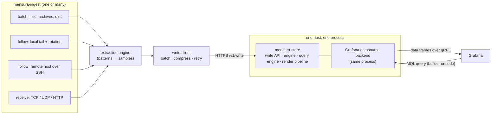

# Mensura — design documentation

Mensura is a standalone, self-contained system for turning **operational text
logs and pushed metrics into interactive Grafana time-series**, built around
one idea: *the operator must be able to trust the plot*. It is a generic
re-implementation of the ingest → store → render loop originally shipped as
the `agi` subcommand of aerolab, with the Aerospike-specific and
deployment/orchestration parts removed, and with three capabilities the
original did not have: continuous file-follow ingest with log rotation,
remote-host ingest, and a network receive path.

The render-time algorithm is specified in *A Correctness-First, Single-Pass
Downsampling Pipeline for Operational Time-Series* (Glonek, 2026,
[DOI 10.5281/zenodo.22133876](https://doi.org/10.5281/zenodo.22133876)).
These documents assume that paper as normative for §3 of the pipeline and
restate its contract in [07-downsampling.md](07-downsampling.md).

---

## The three components

| Component | Binary | Owns | Talks to |
| --- | --- | --- | --- |
| **Ingest** | `mensura-ingest` | Acquisition, extraction, batching | The store's write API (HTTPS) |
| **Store** | `mensura-store` | The embedded LSM engine, write API, query engine, render pipeline | Ingest (inbound), Grafana (inbound) |
| **Plugin** | shipped *inside* `mensura-store` | Grafana datasource backend + frontend query builder | The store (in-process, or over the query API) |

Two binaries, three components. The plugin is not a third binary because
plugin and store are Grafana neighbours: the Grafana datasource backend
process *is* the store process in the default topology, so a panel query is
a function call and an LSM iterator, not a network hop.

Ingest is a separate binary and always speaks to the store over the network
API — **in every mode, including one-shot batch import**. There is no
"import directly into the database file" shortcut. One write path means one
set of semantics to reason about (ordering, idempotency, backpressure,
auth), and it is what makes remote and push ingest fall out for free.

---

## Reading order

| # | Document | What it settles |
| --- | --- | --- |
| 01 | [Architecture](01-architecture.md) | Components, process/ownership model, topologies, end-to-end flows |
| 02 | [Ingest](02-ingest.md) | The `mensura-ingest` binary: acquisition modes, pipeline, rotation, checkpoints, backpressure |
| 03 | [Extraction spec](03-extraction.md) | The generic pattern/metric-definition file that replaces AGI's `patterns.yml` |
| 04 | [Wire protocol](04-wire-protocol.md) | Ingest → store write API, receive-side line protocols, idempotency, auth |
| 05 | [Storage engine](05-storage.md) | Keyspace, codec, schema, label dictionary, retention, durability, tunings |
| 06 | [Query language](06-query.md) | MQL: grammar, JSON AST, semantics, planning, safety gates |
| 07 | [Downsampling](07-downsampling.md) | The ten-stage render walk and its correctness contract |
| 08 | [Grafana plugin](08-plugin.md) | Native backend datasource, visual builder, variables, annotations, alerting |
| 09 | [Operations](09-operations.md) | Configuration, deployment, sizing, security, observability, failure modes |
| 10 | [Decisions](10-decisions.md) | ADR-style record of the choices, with the alternatives that were rejected |
| 11 | [Roadmap](11-roadmap.md) | Milestones, test strategy, open questions |

---

## Scope

**In scope**

- One-shot batch ingest of logs (files, directories, nested archives) from local
  disk, S3, or SFTP.
- Continuous file-follow ingest with full log-rotation handling, locally and on
  remote hosts.
- Network receive: line-protocol over TCP and UDP, and an HTTP JSON API, for
  senders that already have metrics.
- Generic, declarative extraction of `(timestamp, labels, fields)` tuples from
  unstructured or semi-structured text.
- An embedded, single-process LSM store with a covering time-range index,
  tuned for burst ingest and interactive range scans.
- A query language (MQL) with a lossless JSON AST and a visual builder.
- The ten-stage per-series render pipeline from the whitepaper.
- A native Grafana backend datasource plugin.

**Out of scope**

- Provisioning, deploying or managing infrastructure (this is not aerolab).
  Mensura ships binaries, a systemd unit example and a container image; where
  they run is the operator's business.
- Any product-specific knowledge. Nothing in the core knows what an Aerospike,
  a Kafka or an nginx is; product knowledge lives entirely in extraction spec
  files and dashboards, which are data, not code.
- Full-text log search. Mensura extracts structured samples from logs; it is
  not a log store and does not build an inverted index. Grepping the original
  files remains the right tool for free-text.
- Clustering, replication, high availability of the store. One process, one
  directory. See [10-decisions.md](10-decisions.md) ADR-011 for why, and what
  the escape hatch is.
- PromQL/InfluxQL compatibility, cross-series arithmetic at render time, and
  recording rules (see ADR-008).

---

## Assumptions

These are stated so they can be challenged; nothing below is load-bearing on
information outside this repository.

1. **Implementation language is Go** for both binaries, matching the origin
   code, the Grafana plugin SDK, and Pebble.
2. **Storage engine is [Pebble](https://github.com/cockroachdb/pebble)**, as in
   AGI, with the tunings carried over verbatim (see [05-storage.md](05-storage.md)).
3. **Grafana 11 or later**, which is the baseline for the current backend plugin
   SDK, data-frame contract, and the builder/code query-editor pattern.
4. **License is Apache-2.0**, matching the `LICENSE` file already in this
   repository.
5. Where AGI behaviour and the whitepaper disagree in detail, the **whitepaper
   is normative** and the difference is called out explicitly.
